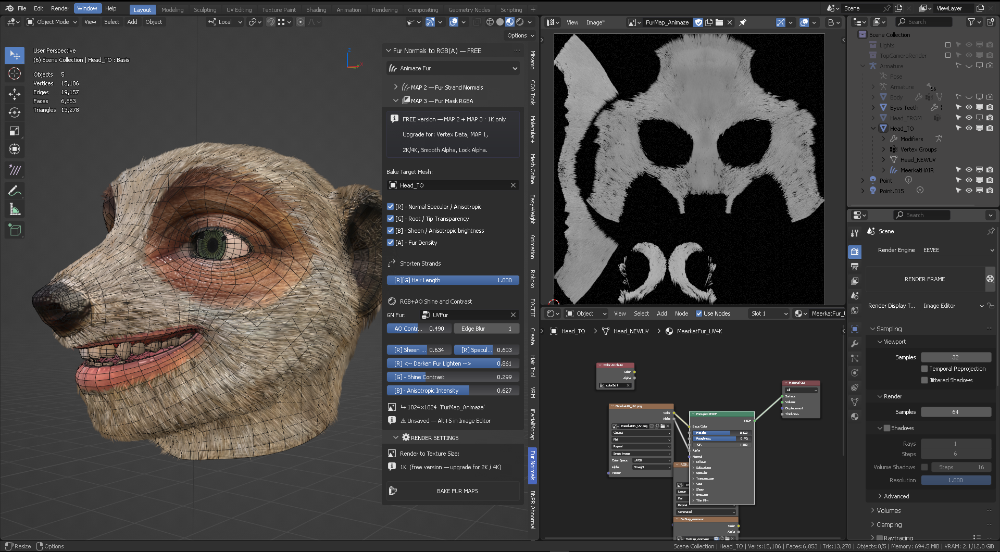
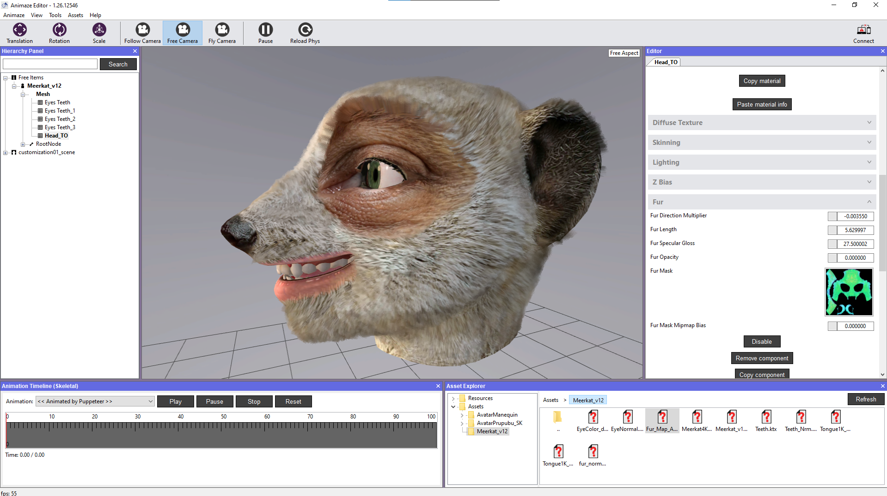
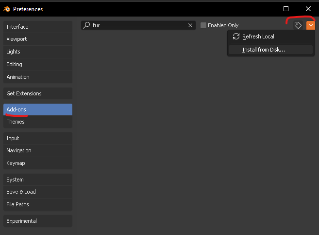

# Fur Normals to RGBA
_Bake GN Fur into Animaze &amp; Game-Ready Maps_

Fur Normals to RGB(A) converts Geometry Nodes fur into clean, game-ready texture maps in a single bake.
It captures mesh normals, fur direction, and strand data to generate texture maps for **short hair**.
The addon auto-packs Sheen, Anisotropic, and Ambient Occlusion into optimized RGBA outputs with slider adjustments for full artistic control.
Built for Animaze avatars and real-time engines, it turns procedural fur into production-ready texture maps fast.

Fur Normals to RGBA makes it easy to bake your groomed GN hair. Groom once with Geometry Nodes, then dial in sheen, brightness, length, AO, and anisotropy with precision. Hit “Bake Fur Maps” and get clean, Animaze-ready RGBA fur mask textures—fast, consistent, and production-ready. Use your time creatively to groom **short fur hair** with Blender's native Geometry hair Nodes once, and you can adjust parameters for sheen, fur brightness, fur length, ambient occlusion, shine contrast, anisotropic intensity, all correctly packed and compliant to Animaze's fur shader, ready to bake with 1 single button "Bake Fur Maps".

## Install
1. Download ZIP
2. Edit > Preferences > Add-ons > Install
3. Enable "Fur Normals to RGBA"

